<div align="center">

# 🛡️ Agentic SOC Investigation Engine  
### ATT&CK Mapping • AI-Assisted Analysis • SOAR • Stateful Investigation


</div>

<div align="center">
  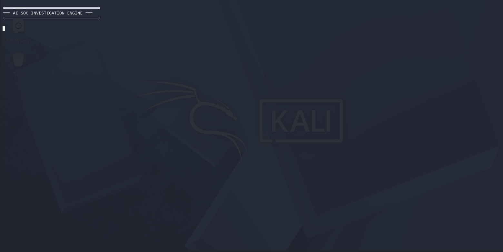
</div>

<p align="center"><em>Figure 1. End-to-end SOC investigation pipeline demonstrating ingestion → detection → analysis → response.</em></p>

---

## ⚡ Quick Start (Run the Project)

Run the full investigation pipeline in minutes.

### 1. Open the project folder

```bash
cd ~/Agentic-SOC-Investigation-Engine-main
```

---

### 2. Create and activate a virtual environment

```bash
python3 -m venv .venv
source .venv/bin/activate
```

---

### 3. Install dependencies

```bash
pip install -r requirements.txt
```

---

### 4. Download MITRE ATT&CK data

```bash
mkdir -p data/raw
curl -L "https://raw.githubusercontent.com/mitre/cti/master/enterprise-attack/enterprise-attack.json" -o data/raw/enterprise-attack.json
```

---

### 5. Run full demo pipeline

```bash
chmod +x run_demo.sh
./run_demo.sh
```

---

### 📁 Expected Outputs

```text
output/
├── mapped_alerts.json
├── normalized_zeek_alerts.json
├── threat_hunt_findings.json
├── coverage_summary.json
```

---

## 🔄 Evolution: From Detection → Investigation

This project builds directly on the **AI-Assisted SOC + MITRE ATT&CK Mapping Engine**.

### 🧩 Previous Project (Detection-Focused)

```text
Alert → ATT&CK Mapping → Output
```

- single-alert analysis  
- technique classification  
- scoring + confidence  

---

### 🤖 This Project (Agentic Investigation)

```text
Alert → Context → Correlation → Investigation → Decision
```

- multi-step reasoning  
- alert correlation  
- enrichment (IOC, vulnerability, asset)  
- SOAR playbooks  
- investigation loop  
- response recommendation  

---

## 👀 What This System Does

Modern SOCs don’t just detect threats — they investigate them.

This system:

- enriches alerts with context  
- correlates related activity  
- applies behavioral reasoning  
- iteratively builds understanding  
- recommends response actions  

---

## 🧠 Scenario

SOC analysts face:

- fragmented alerts  
- missing context  
- manual correlation  
- inconsistent prioritization  

Detection alone is not enough.

This project simulates a SOC that performs:

> **structured investigation and decision-making**

---

## 🎯 Objective

Build a system that behaves like a **junior SOC analyst**, capable of:

- analyzing alerts  
- mapping to ATT&CK  
- enriching context  
- correlating activity  
- explaining findings  
- recommending actions  

---

## 🔍 How the System Works (Under the Hood)

The following sections show how the system operates internally.

---

## 🧠 SOC Investigation Workflow

| Stage | Description |
|------|------------|
| 🟦 Raw Security Alert | Alert ingestion from SIEM |
| 🟨 Triage + ATT&CK Mapping | Behavioral classification |
| 🟪 SOAR Playbook Selection | Response logic selection |
| 🧠 AI-Assisted Analysis | Explanation generation |
| 🧬 Context Enrichment | IOC, vulnerability, asset context |
| 🔁 Investigation Loop | Iterative reasoning |
| 🚨 Response Recommendation | Final decision |

---

## ⚙️ 🔬 Technical Pipeline

```text
Detection
    ↓
Triage Scoring
    ↓
ATT&CK Retrieval (TF-IDF)
    ↓
Semantic Reranking (Embeddings)
    ↓
Hybrid ATT&CK Scoring
    ↓
SOAR Playbook Selection
    ↓
AI Analyst Explanation
    ↓
IOC Enrichment
    ↓
Vulnerability Context
    ↓
Asset Context
    ↓
Stateful Investigation Loop
    ↓
Response Recommendation
```

---

## 🧠 Key Idea

> Each stage reduces uncertainty and increases confidence until a response decision is made.

---

## ⚙️ Step 1 — Log Ingestion

<div align="center">
  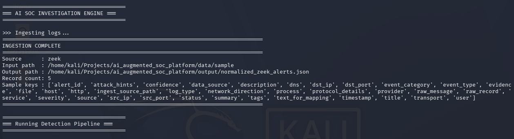
</div>

<p align="center"><em>Logs ingested and normalized into structured alerts.</em></p>

---

## 🔍 Step 2 — ATT&CK Mapping Output

<div align="center">
  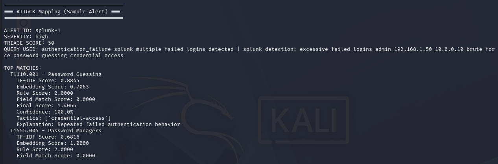
</div>

<p align="center"><em>Ranked ATT&CK techniques with confidence scoring.</em></p>

---

## ⚙️ Step 3 — SOAR + AI Analyst Layer

<div align="center">
  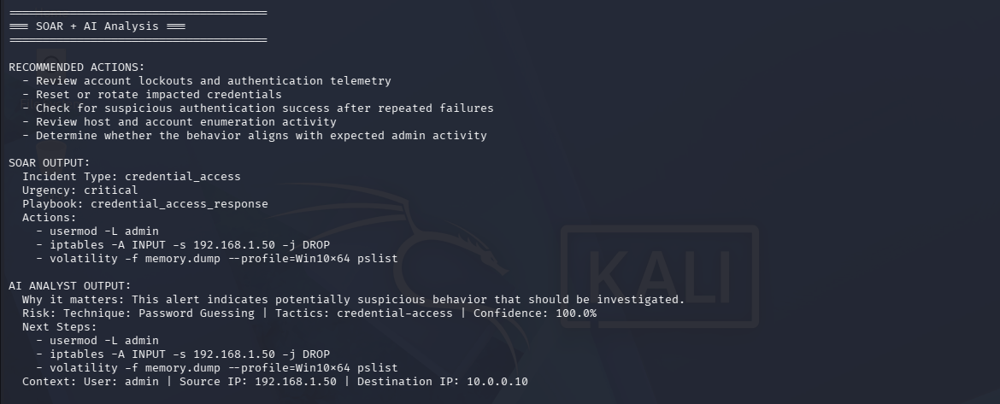
</div>

<p align="center"><em>Playbook execution and analyst-style reasoning output.</em></p>

---

## 🧬 Step 4 — Vulnerability + Asset Context

<div align="center">
  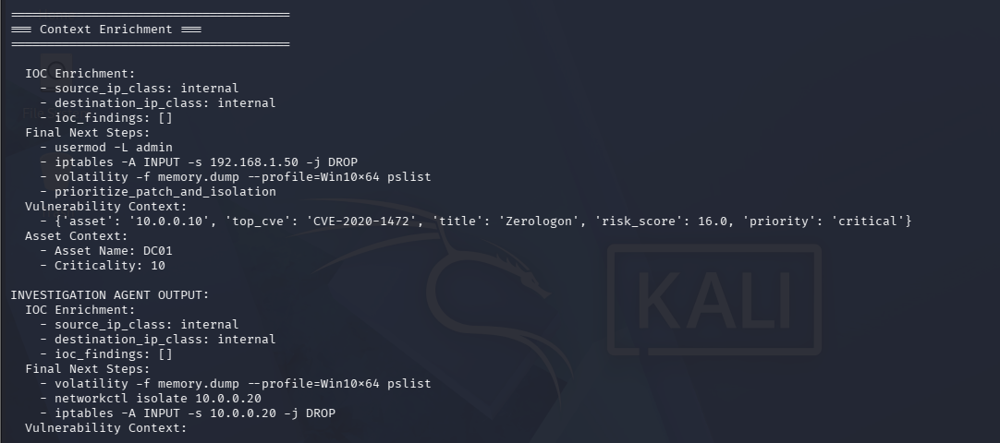
</div>

<p align="center"><em>Context enrichment influencing prioritization.</em></p>

---

## 🤖 Step 5 — Investigation Agent

<div align="center">
  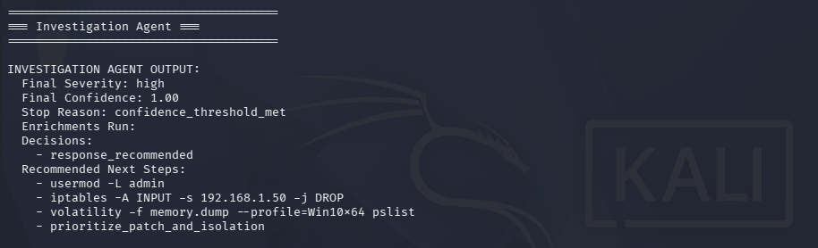
</div>

<p align="center"><em>Agent recommending response actions based on accumulated evidence.</em></p>

---

## 🔎 Step 6 — Threat Hunting Findings

<div align="center">
  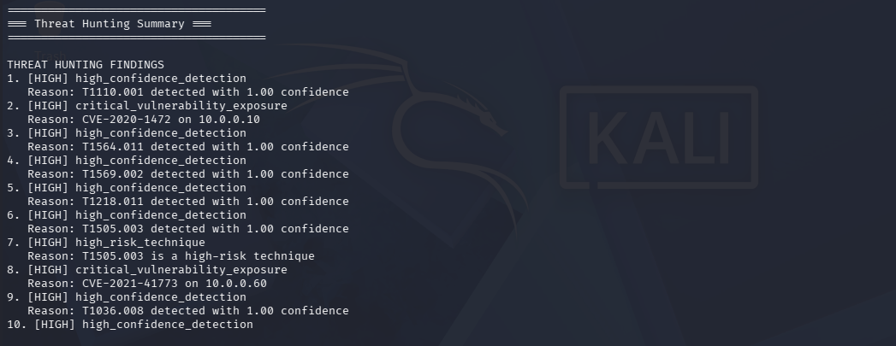
</div>

<p align="center"><em>Threat hunting layer identifying broader attack patterns.</em></p>

---

## 🧠 Engine Breakdown

<div align="center">
  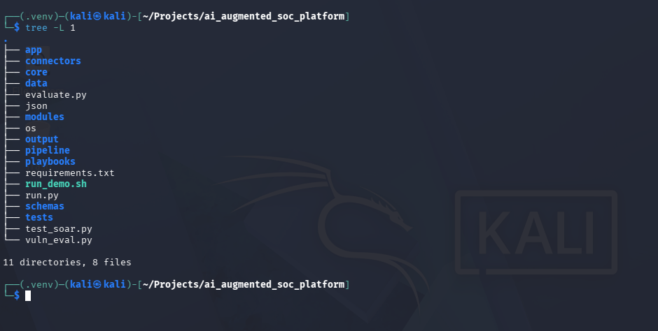
</div>

<p align="center"><em>Project structure separating pipeline, modules, and engine logic.</em></p>

---

<div align="center">
  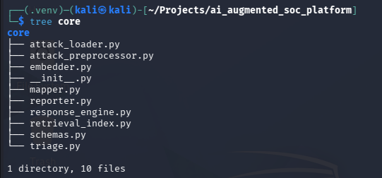
</div>

<p align="center"><em>Core engine orchestrating ingestion, preprocessing, and mapping.</em></p>

---

<div align="center">
  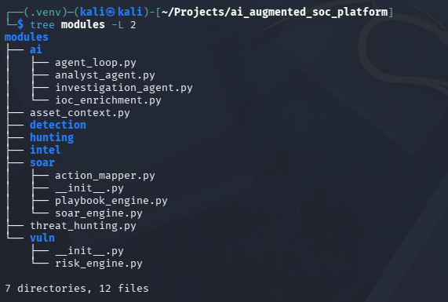
</div>

<p align="center"><em>Modules handling AI reasoning, SOAR logic, enrichment, and threat hunting.</em></p>

---

<div align="center">
  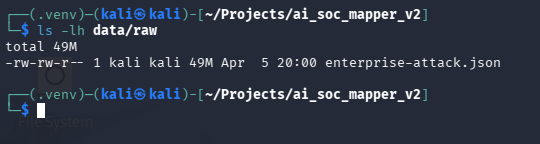
</div>

<p align="center"><em>ATT&CK dataset transformed into structured corpus.</em></p>

---

<div align="center">
  
</div>

<p align="center"><em>TF-IDF retrieves candidate techniques.</em></p>

---

<div align="center">
  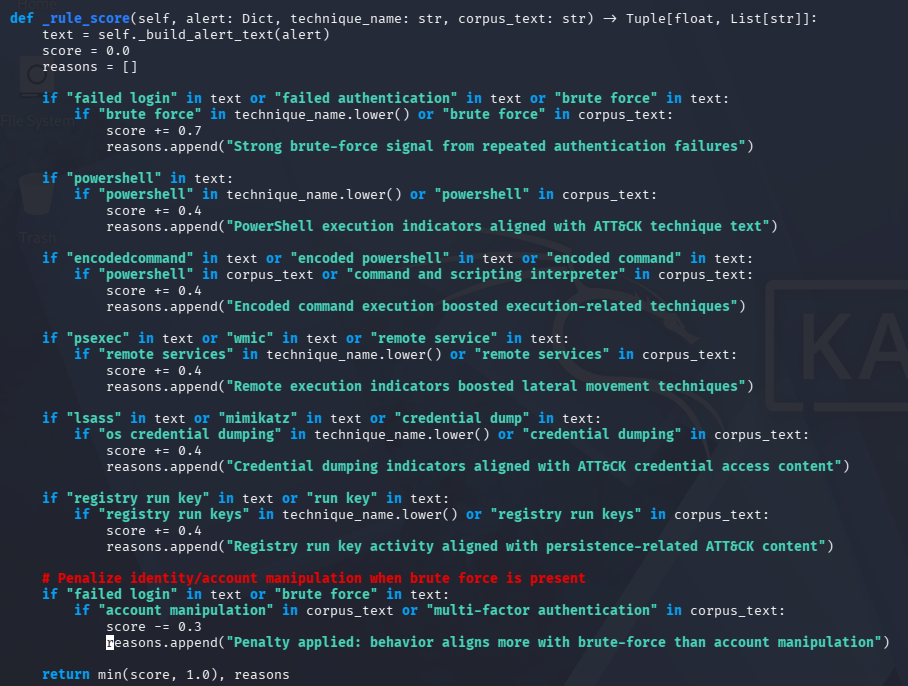
</div>

<p align="center"><em>Behavior-based scoring improves mapping precision.</em></p>

---

<div align="center">
  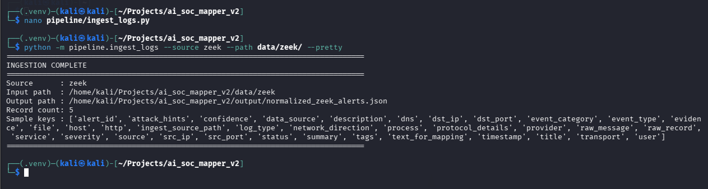
</div>

<p align="center"><em>Zeek logs successfully ingested.</em></p>

---

<div align="center">
  
</div>

<p align="center"><em>Alerts standardized into consistent schema.</em></p>

---

<div align="center">
  
</div>

<p align="center"><em>System generates structured outputs.</em></p>

---

<div align="center">
  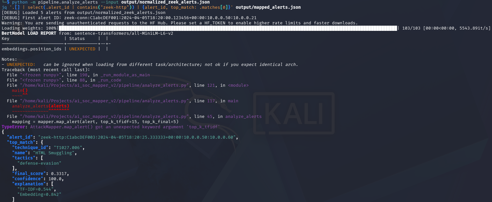
</div>

<p align="center"><em>Example web shell detection mapped to ATT&CK.</em></p>

---

## 🧪 Example Output

```text
INVESTIGATION AGENT OUTPUT:
Final Severity: high
Final Confidence: 1.00

Decisions:
- response_recommended

Recommended Next Steps:
- usermod -L admin
- iptables -A INPUT ...
- volatility analysis
```

---

## 💡 What This Project Demonstrates

- SOC investigation workflows  
- ATT&CK-based detection engineering  
- correlation + enrichment  
- agentic reasoning systems  
- decision-support automation  

---

## 💼 SOC Relevance

Simulates:

- Tier 1 / Tier 2 analyst workflows  
- incident investigation  
- threat prioritization  
- response decision-making  

---

## 🚧 Future Improvements

- real-time ingestion  
- SIEM/XDR integration  
- threat intelligence feeds  
- autonomous response actions  

---

<div align="center">

## 👤 Shannon Smith  

Cybersecurity | SOC Operations • Detection Engineering • Incident Response  

</div>
