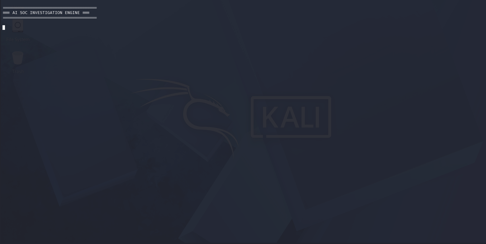
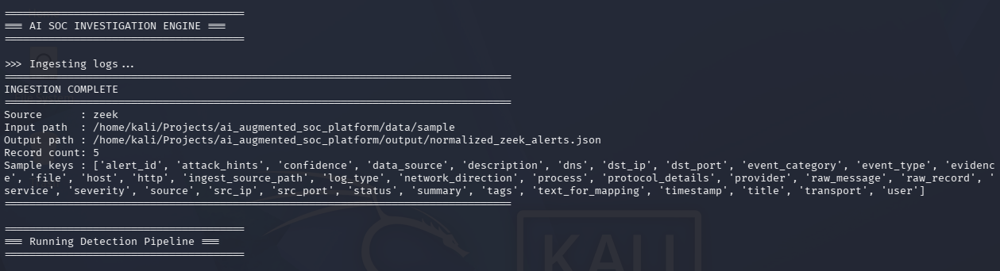
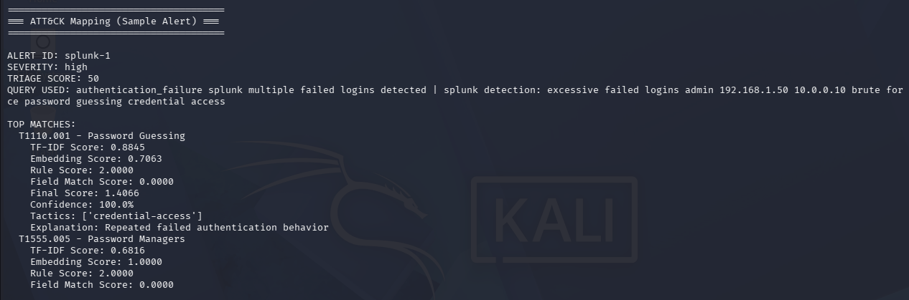
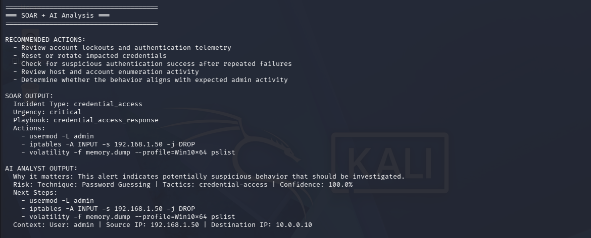
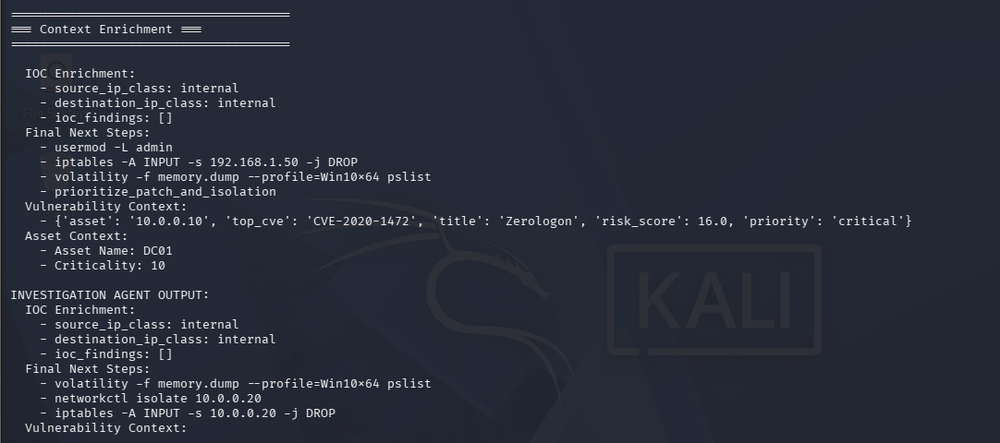
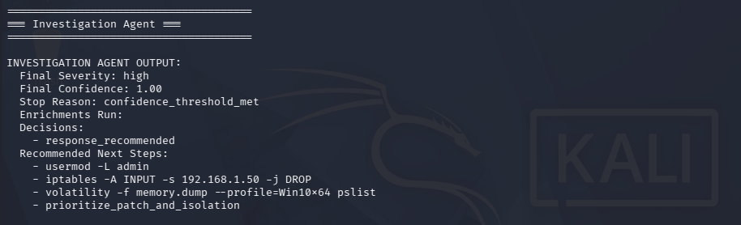
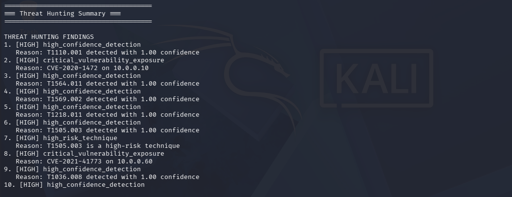

<div align="center">

# 🛡️ Agentic SOC Investigation Engine

## 🧠 SOC Systems • Detection Engineering • Agentic Investigation


</div>

<div align="center">
  
</div>

<p align="center"><em>End-to-end SOC investigation pipeline demonstrating ingestion → detection → agentic reasoning → response.</em></p>

---

## 🧠 Purpose

A full SOC investigation pipeline that takes raw security alerts from ingestion to final response recommendation using a stateful agentic investigation loop. The system runs ATT&CK mapping from Phase 2, classifies incidents by tactic, selects a SOAR playbook, then hands off to an investigation agent that accumulates evidence across multiple enrichment steps — IOC classification, CVE vulnerability context, asset criticality, and cross-alert entity correlation — updating a confidence score at each step before producing a final disposition and recommended actions.

This is **Phase 3** of a multi-phase SOC system and the most complete stage. It builds directly on Phase 2's NLP detection pipeline and adds the full investigation layer on top.

| Stage | Description |
|-------|-------------|
| Alert Analysis | Understanding and triaging security events |
| Detection Engineering | Mapping behavior to MITRE ATT&CK |
| Investigation | Correlating and enriching alerts |
| Decision Support | Recommending response actions |

---

## 🎯 Objective

The goal of this phase is to demonstrate:

- how a stateful investigation agent accumulates evidence across multiple enrichment steps, updating confidence at each one
- how SOAR incident classification and playbook selection drive triage-to-response automation
- how IOC enrichment, vulnerability context (real CVEs), and asset criticality scoring influence investigation decisions
- how cross-alert entity correlation identifies patterns across source IPs and usernames
- how a threat hunting layer identifies anomalies across the full alert set after individual investigations complete

---

## 🤖 Phase 3 — Agentic SOC Investigation Engine


| Category | Details |
|----------|---------|
| Focus | Investigation and decision support |
| Role | SOC analyst + automation system |
| Output | Per-alert investigation state, confidence score, decisions, response actions, threat hunt findings |

---

## 🧩 What Makes This Agentic

The word "agentic" gets used loosely, so it's worth being specific about what it means here.

The `run_investigation_loop()` in `investigation_agent.py` maintains a **stateful case object** for each alert and runs a `choose_next_action()` decision function at each step. Rather than executing a fixed sequence of steps, the agent decides what to do next based on current state — specifically its accumulated confidence score and which enrichment steps have already run.

The loop has a maximum of 5 steps, but can terminate early if confidence reaches ≥ 90% (meaning the evidence is strong enough to move directly to response without additional enrichment). Each enrichment step that runs updates the confidence score:

| Enrichment Step | Confidence Boost |
|-----------------|-----------------|
| IOC hit found | +15% |
| Critical CVE on destination asset | +10% |
| High CVE on destination asset | +5% |
| High-criticality asset targeted (score ≥ 8) | +5% |
| Related alerts found via entity correlation | +5% |

This means an alert against `DC01` (criticality 10, running CVE-2020-1472 Zerologon) with an external source IP will accumulate confidence faster than an alert against a low-value workstation with no IOC hits, and the agent's path through the loop reflects that difference. High-confidence cases skip straight to response; low-confidence cases gather more evidence first.

---

## 🧠 Full Investigation Workflow

| Stage | Description |
|-------|-------------|
| 🟦 Raw Alert | Ingestion from Zeek logs or Splunk JSON |
| 🟨 Triage + ATT&CK Mapping | Phase 2 pipeline: triage score, hybrid scoring, ranked techniques |
| 🟣 SOAR Incident Classification | Tactic-weighted scoring → incident type → playbook selection |
| 🧠 AI Analyst Layer | Rule-based analyst reasoning: why it matters, risk summary, context |
| 🔵 Agent Decision | `choose_next_action()` evaluates confidence and selects next enrichment step |
| 🧬 IOC Enrichment | IP classification (internal/external) + known malicious feed lookup |
| 🔴 Vulnerability Context | CVE lookup by destination IP against asset vulnerability database |
| 🏢 Asset Context | Criticality score lookup (1–10) from asset registry |
| 🔗 Entity Correlation | Cross-alert correlation by source IP, destination IP, and username |
| ✅ Response Recommendation | Final decision: disposition, confidence %, next steps, escalation if needed |
| 🎯 Threat Hunting | Post-investigation anomaly detection across full alert set |

---

## ⚡ Quick Start

### 1. Clone the repository

```bash
git clone https://github.com/shannonasmith/Agentic-SOC-Investigation-Engine.git
cd Agentic-SOC-Investigation-Engine
```

### 2. Create and activate a virtual environment

```bash
python3 -m venv .venv
source .venv/bin/activate
```

### 3. Install dependencies

```bash
pip install -r requirements.txt
```

### 4. Download MITRE ATT&CK dataset

```bash
mkdir -p data/raw
curl -L "https://raw.githubusercontent.com/mitre/cti/master/enterprise-attack/enterprise-attack.json" \
  -o data/raw/enterprise-attack.json
```

### 5. Run the full pipeline

```bash
chmod +x run_demo.sh
./run_demo.sh
```

**Output files written to `output/`:**
```
mapped_alerts.json            # Per-alert: ATT&CK matches, triage, SOAR, agent state, investigation log
normalized_zeek_alerts.json   # Normalized Zeek alert schema
threat_hunt_findings.json     # Cross-alert anomaly findings
coverage_summary.json         # ATT&CK technique coverage across all alerts
```

---

## 👀 What This Looks Like in Practice

---

### ⚙️ Step 1 — Log Ingestion

<div align="center">
  
</div>

Zeek `conn.log` and `http.log` are parsed by the `ZeekAdapter` (from Phase 2) into normalized alert schema with `text_for_mapping`, severity, tags, and protocol details. Splunk JSON alerts are normalized via `SplunkAdapter`, inferring event type from signature and command-line text. Both formats feed the same downstream pipeline.

---

### 🔍 Step 2 — ATT&CK Mapping Output

<div align="center">
  
</div>

Each normalized alert runs through the full Phase 2 mapping pipeline — triage scoring, TF-IDF candidate retrieval, embedding reranking, and hybrid scoring — producing a ranked list of ATT&CK techniques with per-component scores and confidence percentages. This output drives all downstream SOAR and agent decisions.

---

### ⚙️ Step 3 — SOAR + AI Analyst Layer

<div align="center">
  
</div>

The SOAR engine classifies the incident type by scoring matched ATT&CK tactics weighted by technique confidence — `lateral-movement` and `credential-access` carry priority 5; `discovery` and `collection` carry priority 2. The highest-scoring tactic determines incident type, which selects a playbook from the six available (`lateral_movement`, `credential_access`, `persistence`, `defense_evasion`, `reconnaissance`, `collection`). Each playbook returns a set of concrete response actions (e.g. `lateral_movement` returns `disable_account`, `isolate_host`, `block_ip`).

The AI analyst layer then generates a structured explanation — why the alert matters given the event type, a risk summary with technique and confidence, and context (user, source IP, destination IP).

---

### 🧬 Step 4 — Vulnerability + Asset Context

<div align="center">
  
</div>

The agent looks up the alert's destination IP against two databases:

**Asset registry** (`data/assets.json`) maps IPs to hostnames and criticality scores (1–10). Key assets include DC01 (criticality 10), WEB01 (criticality 9), ADMIN-BOX (criticality 8).

**Vulnerability database** (`data/vulnerabilities.json`) maps assets to real CVEs with CVSS scores and exploit availability. Examples: DC01 carries CVE-2020-1472 (Zerologon, CVSS 10.0); WEB01 carries CVE-2021-41773 (Apache Path Traversal, CVSS 7.5, internet-exposed). A destination asset with a critical CVE and exploit available increases investigation confidence by +10% and escalates severity to `critical`.

---

### 🤖 Step 5 — Investigation Agent

<div align="center">
  
</div>

The stateful investigation loop runs `choose_next_action()` at each step, selecting from: `check_ioc` → `check_vulnerability` → `check_asset_criticality` → `correlate_entities` → `recommend_response`. If confidence reaches ≥ 90% at any point, the agent skips remaining enrichment and moves directly to response recommendation. The final agent state includes:

- `decisions[]` — list of conclusions reached (e.g. `high_confidence_detection`, `critical_asset_at_risk`, `ioc_enrichment_hit`, `entity_correlation_found`)
- `investigation_log[]` — step-by-step record of before/after confidence at each enrichment step
- `stop_reason` — why the loop ended (`confidence_threshold_met`, `max_steps_reached`, or `workflow_completed`)
- `recommended_next_steps[]` — deduplicated action list from playbook + agent decisions, with `escalate_to_ir` appended automatically for critical severity

---

### 🔎 Step 6 — Threat Hunting Findings

<div align="center">
  
</div>

After individual alert investigations complete, `threat_hunting.py` runs a pass across the full result set looking for cross-alert patterns:

- **High-confidence detections** (≥ 90%) flagged individually
- **High-risk techniques** — a hardcoded watchlist of techniques including T1078 (Valid Accounts), T1021 (Remote Services), T1059 (Command and Scripting), T1003 (Credential Dumping), T1505.003 (Web Shell)
- **Repeated IP activity** — source IPs appearing in 2+ alerts
- **Repeated technique patterns** — same ATT&CK technique mapped across 2+ alerts
- **Critical CVE exposure** on any investigated asset

Findings are written to `output/threat_hunt_findings.json` as a ranked list of anomalies with type, severity, and reason.

---

## ⚙️ Technical Pipeline

```text
Raw Logs (Zeek conn.log / http.log  or  Splunk JSON)
    ↓
Normalization (ZeekAdapter / SplunkAdapter)
    ↓
Triage Scoring (keyword signal → severity band)
    ↓
ATT&CK Mapping (TF-IDF retrieval → embedding rerank → hybrid score)
    ↓
SOAR Classification (tactic-weighted scoring → incident type → playbook)
    ↓
AI Analyst Explanation (rule-based reasoning layer)
    ↓
Agent Decision: choose_next_action() based on confidence + steps run
    ↓
IOC Enrichment (IP classification + known suspicious feed lookup)
    ↓
Vulnerability Context (CVE lookup by destination IP)
    ↓
Asset Context (criticality score from asset registry)
    ↓
Entity Correlation (cross-alert source IP, destination IP, username)
    ↓
Response Recommendation (disposition + next steps + escalation)
    ↓
Threat Hunting (cross-alert anomaly detection across full result set)
    ↓
Output (mapped_alerts.json, threat_hunt_findings.json, coverage_summary.json)
```

---

## 💡 What This Project Demonstrates

- Stateful agentic investigation loop with confidence-driven early termination
- SOAR incident classification using tactic-weighted confidence scoring
- Playbook-driven response action selection across 6 incident categories
- IOC enrichment with IP classification and threat feed lookup
- Vulnerability context using real CVEs (Zerologon, PrintNightmare, Apache Path Traversal) mapped to asset criticality
- Cross-alert entity correlation by source IP, destination IP, and username
- Post-investigation threat hunting for high-risk technique patterns and repeated activity
- Full audit trail via per-step investigation log with before/after confidence tracking

---

## 💼 SOC Relevance

Simulates real Tier 1/Tier 2 SOC investigation work:

- Alert triage and ATT&CK classification (Tier 1)
- Contextual enrichment with asset and vulnerability data (Tier 2)
- SOAR playbook execution and response action generation
- Escalation logic for critical severity and high-confidence detections
- Threat hunting across the full alert set for campaign-level patterns

---

## 🧬 Project Progression

This project is part of a **multi-phase SOC system**:

[SOC Alert Analyzer](https://github.com/shannonasmith/AI-Assisted-SOC-Alert-Analyzer) → [ATT&CK Mapping Engine](https://github.com/shannonasmith/AI-Assisted-SOC-MITRE-ATTACK-Mapping-Engine) → **Agentic SOC Investigation Engine (current)**

Phase 1 established rule-based alert triage. Phase 2 replaced keyword mapping with a full NLP detection pipeline. This phase adds the investigation, enrichment, and agentic decision layer on top, completing the arc from raw telemetry to analyst-ready response recommendation.

---

## 🚧 Future Improvements

- Real-time ingestion via streaming pipeline
- Live threat intelligence feed integration for IOC enrichment
- SIEM/XDR API integration (Splunk, Elastic, CrowdStrike)
- Autonomous response action execution (not just recommendation)
- LLM integration for the analyst reasoning layer

---

## 🛠️ Tech Stack

| Component | Detail |
|-----------|--------|
| Language | Python 3 |
| ATT&CK Mapping | TF-IDF (`scikit-learn`) + `sentence-transformers` (`all-MiniLM-L6-v2`) |
| ATT&CK Data | MITRE CTI Enterprise ATT&CK JSON |
| Log Sources | Zeek `conn.log` / `http.log`, Splunk JSON |
| SOAR | Custom playbook engine (6 playbooks across major tactic categories) |
| Investigation Agent | Stateful loop with confidence accumulation (`investigation_agent.py`) |
| Vulnerability Data | CVE database with CVSS scores and exploit flags (`data/vulnerabilities.json`) |
| Asset Registry | IP-to-hostname and criticality mapping (`data/assets.json`) |
| Threat Hunting | Cross-alert anomaly detection (`modules/threat_hunting.py`) |
| Output Formats | JSON, ATT&CK Navigator layer |

---

<div align="center">

## 👤 Shannon Smith

Cybersecurity | SOC Operations • Detection Engineering • Incident Response • AI-Assisted Security

</div>
